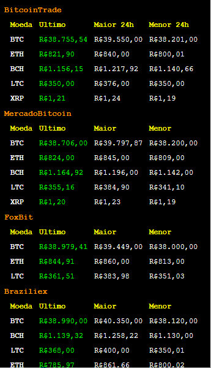

# crypto-brl-extension
Cryptocurrency prices from Brazil's exchanges

## install

```
    yarn install
    yarn watch
    Load unpacked extension on chrome located in dist folder
``` 

### Supported exchanges
- [Bitcointrade](https://www.bitcointrade.com.br/)
- [MercadoBitcoin](https://www.mercadobitcoin.com.br/)
- [FoxBit](https://foxbit.com.br/)
- [Braziliex](https://braziliex.com/)
- [PitaiaTrade](https://pitaiatrade.com/)


